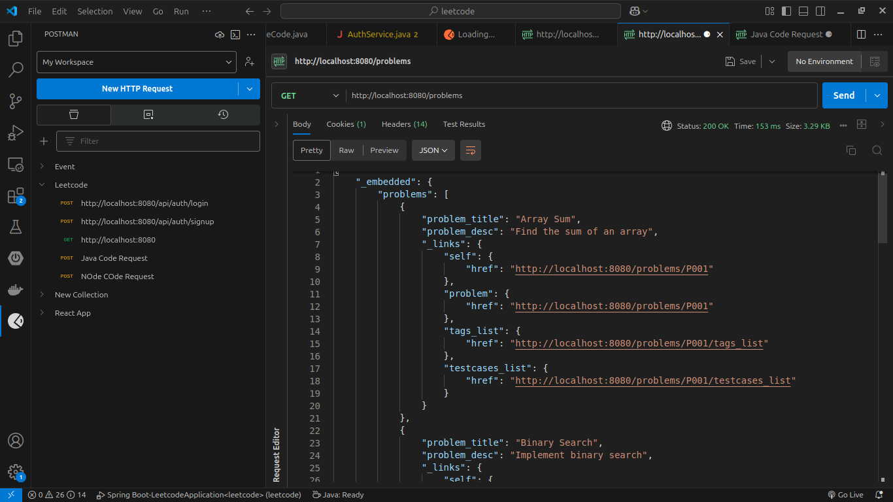
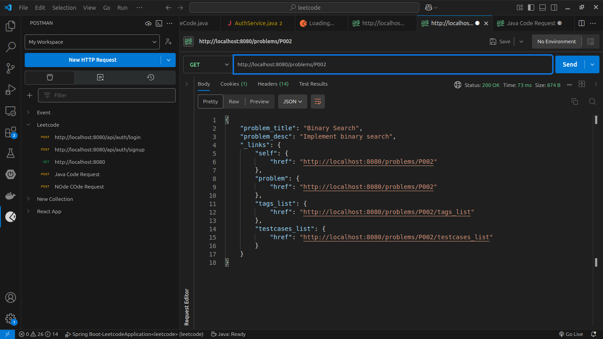
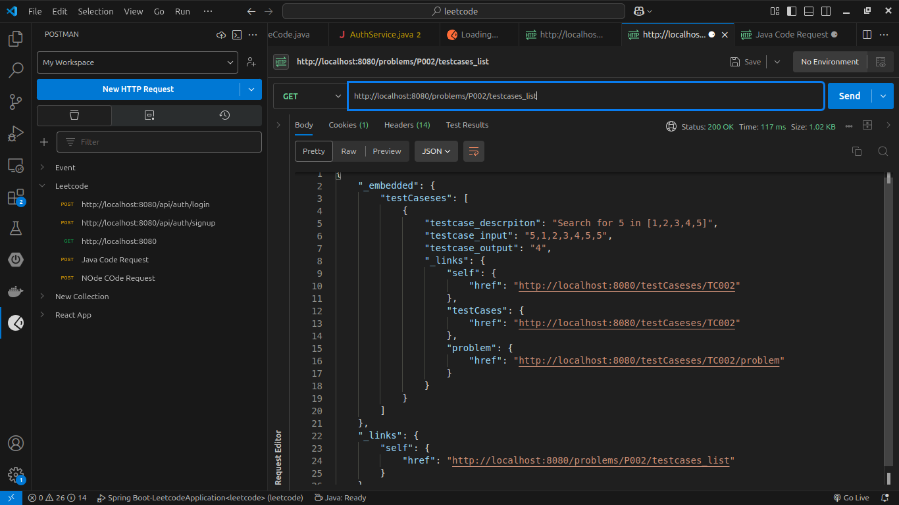
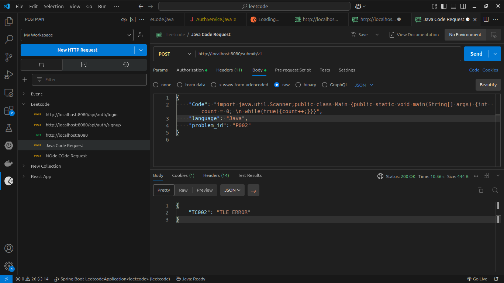
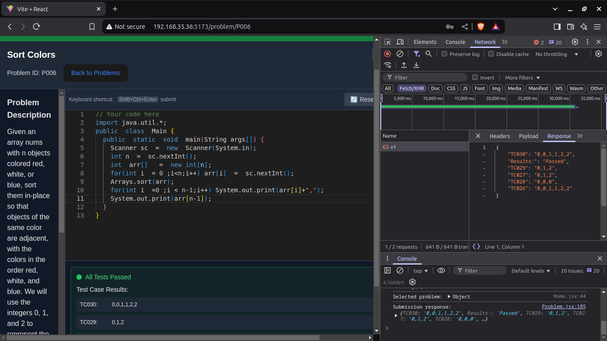
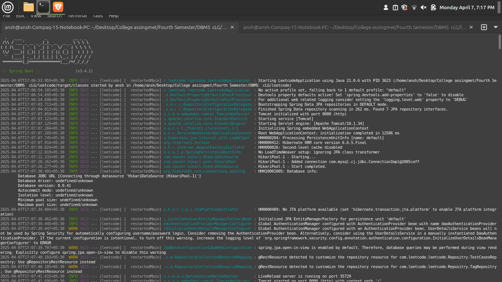
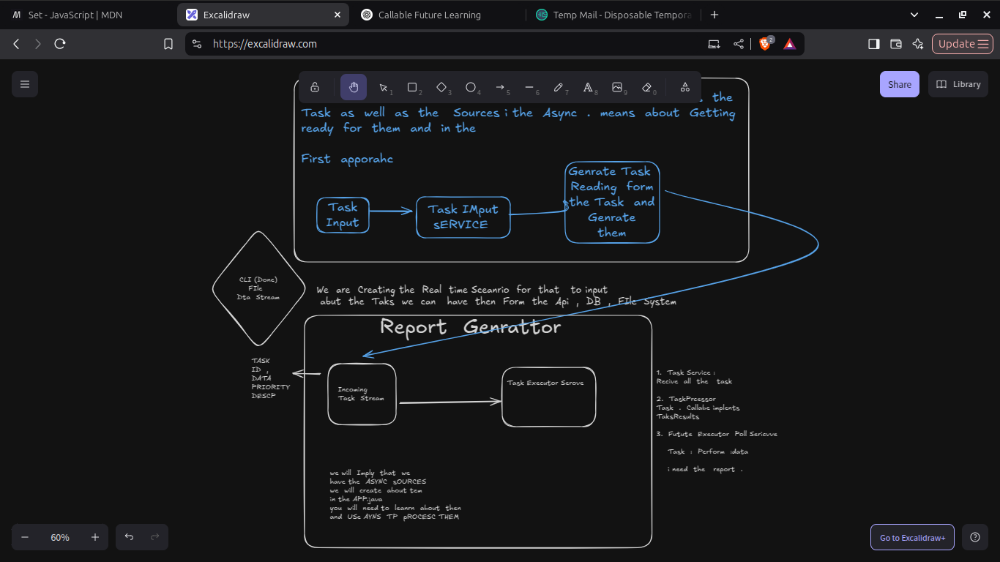

## Project Overview
A sophisticated coding platform built with Spring Boot that implements:
- Code submission and evaluation system supporting multiple programming languages (Java, Python, C++, JS)  
- Code real-time execution on the API server
- Secure user authentication and authorization using JWT
- Automated API generation using Spring Data REST
- Real-time code execution engine
- Database-driven problem management system
- Version 2 under development with containerized execution and async processing

## Technical Architecture
1. Backend Framework:
   - Spring Boot 3.4.2
   - Java 21
   - Maven build system

2. Key Technologies:
   - Spring Data REST for automated API generation
   - Spring Security with JWT for authentication
   - Spring Data JPA with MySQL for data persistence
   - Lombok for reduced boilerplate
   - Cross-Origin Resource Sharing (CORS) enabled

3. Database Design:
   - Problem entity with test cases and tags
   - Submission tracking system
   - User management (Coder entity)
   - Many-to-One relationships for submissions and problems

4. Core Features:
   - Multi-language support (Java, Python, C++, JavaScript)
   - Secure code execution environment
   - Test case validation system
   - Timeout handling (10 seconds limit)
   - Real-time code execution feedback

## Project Structure
```
src/main/java/com/leetcode/leetcode/
├── Core/
│   ├── Configuration/     # Security and Authentication configs
│   ├── Dto/              # Data Transfer Objects
│   ├── Filter/           # JWT Filter
│   ├── Pojo/             # Entity Models
│   ├── Repository/       # Data Access Layer
│   ├── Rest_Controller/  # API Endpoints
│   └── Service/          # Business Logic
└── JudgeService/         # Code Execution Engine
```

## 🖼️ Preview Screenshots

### 📡 Problem Route API



### 🧾 Problem with ID



### 🧪 Test Case API



### 📤 Code Submission API



### 🖥️ Main Application + React UI



### 🧵 Terminal – Spring Boot Startup



### 🔮 V2 System Motivation



---


## API Endpoints
1. Authentication:
   - POST `/api/**` - Public endpoints for authentication
   - JWT-based stateless authentication

2. Code Submission:
   - POST `/submit/v1` - Submit code for execution
   - Supports multiple programming languages
   - Real-time execution results

## Upcoming Features (Version 2)
- Containerized code execution environment
- Asynchronous code processing
- Judge0-style architecture implementation
- Enhanced security measures
-  Cloud-based test case storage (e.g., AWS S3)
-  Secure sandboxing for code evaluation
-  Performance optimization and scalable architecture

## Development Setup
1. Prerequisites:
   - Java 21
   - MySQL Database
   - Maven

2. Database Configuration:
   ```properties
   spring.datasource.url=jdbc:mysql://localhost:3306/test
   spring.datasource.username=root
   spring.datasource.password=your_password
   ```

3. Build and Run:
   ```bash
   mvn clean install
   java -jar target/leetcode-0.0.1-SNAPSHOT.war
   ```

## Technical Highlights
1. Secure Code Execution:
   - Isolated execution environment
   - Timeout management (10-second execution limit)
   - Resource limitation
   - Secure file handling

2. Database Integration:
   - JPA entities with complex relationships
   - Automated REST API generation
   - Transaction management
   - Efficient data persistence

3. Security Features:
   - JWT-based authentication
   - CORS configuration
   - Stateless session management
   - Protected endpoints


## 📂 Modules

### 1. Core Module (`/Core`)
Handles everything related to user, problem, and submission management.

**Key Components:**

- **Security & Config:**  
  - `SecurityConfiguration.java` – Sets up Spring Security  
  - `AuthenticationBeans.java` – Beans for authentication components

- **Models (Entities):**  
  - `App_User`, `Coder`, `Admin`  
  - `Problem`, `TestCases`, `Tag`, `Submission`, `Badge`, `BoilerPlateCode`

- **DTOs:**  
  - `LoginDto`, `SignupDto`, `SubmissionDto`

- **Repositories:**  
  - Individual repositories for all entities (e.g., `UserRepository`, `ProblemRepository`, etc.)

- **Controllers:**  
  - `AuthRoute` – login/signup  
  - `Submit_Route` – handles code submissions  
  - `LogoutRoute` – handles logout logic

- **Services:**  
  - `AuthService`, `JwtService`, `UserServiceImplementation`

---

### 2. Judge Service (`/JudgeService`)
Executes submitted code and verifies output against test cases.

**Key Components:**

- `CodeExecutorService.java` – Executes user-submitted code  
- `TestCaseExecutorService.java` – Runs code against all relevant test cases  
- `JudgeDto.java` – DTO used for execution and result transmission

---


This project demonstrates strong proficiency in:
- Spring Boot application development
- RESTful API design
- Security implementation
- Database design
- Code execution engine development
- Clean code architecture

##  Why This Project Matters

This isn't just another CRUD app — it's a **real-world platform** that simulates a LeetCode environment

- Secure authentication and session management
- Clean modular design
- Spring Boot best practices
- Judge engine integration

---
